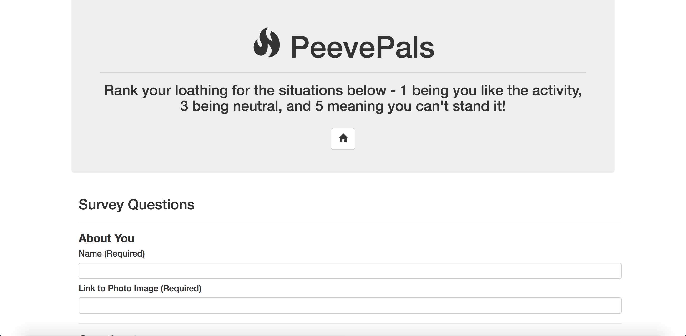

# PeevePal

A fullstack app to determine friend-compatibility based off answers to a survey about pet peeves

Click below to visit the site!
[PeevePal App](hhttps://peevepals.herokuapp.com/)

## Screenshot

## Getting Started

You can visit the site via the Heroku link or if you'd like to be more hands-on you can download the project here and work on it locally. Remember to run "npm i" locally before trying to run to install dependencies.

### Prerequisites

npm [express](https://www.npmjs.com/package/express)

npm [mysql](https://www.npmjs.com/package/mysql)

npm [body-parser](https://www.npmjs.com/package/body-parser)

### Technologies Used

Languages - HTML5, CSS3, Javascript, Node.js, MySQL

Text Editor - VS Studio

## Contributing

Please feel free to branch off and make some tweaks and make a PR. Open to any cool suggestions!

## Future Development

* Remember usernames and passwords
* Add more sophisticated error handling
* Refactor code for brevity and enhanced usability
* Add more styling to page
* Add a picture upload button to simplify the picture process for deksktop and mobile

## Authors

* **Robert Brown** - [Github](https://github.com/robertbernardbrown)
